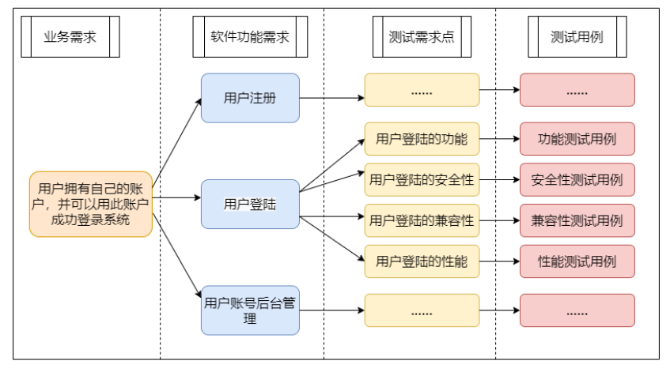
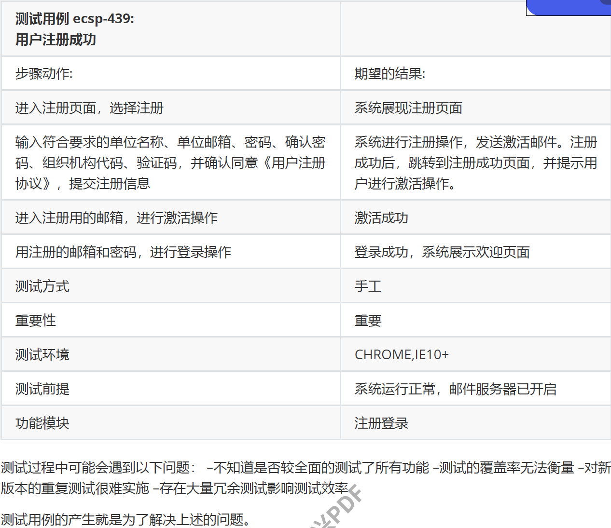
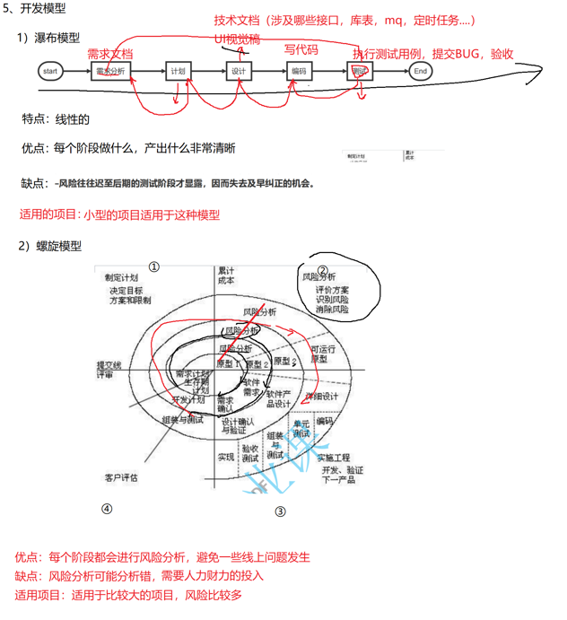
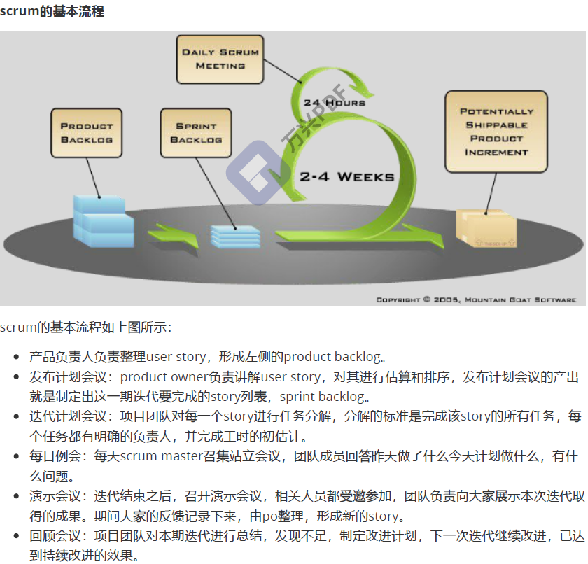
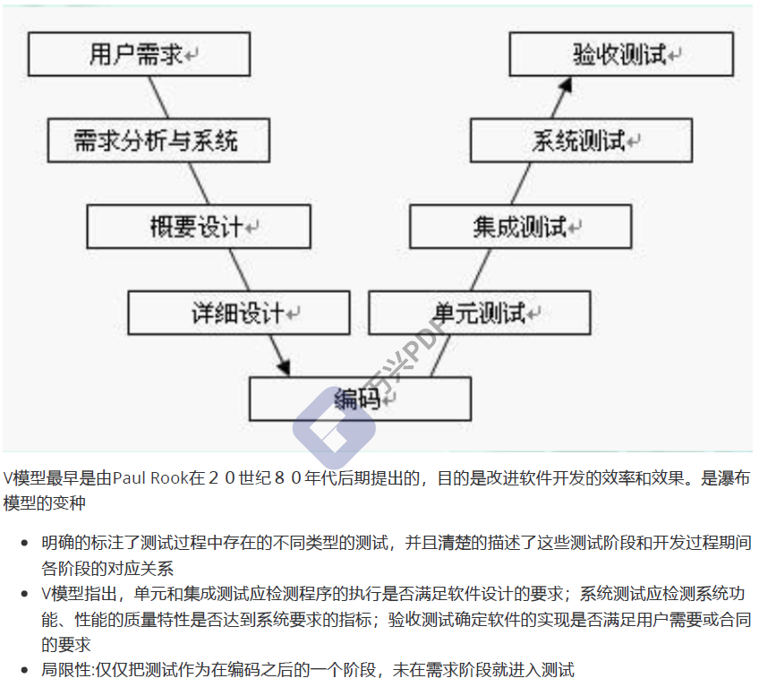
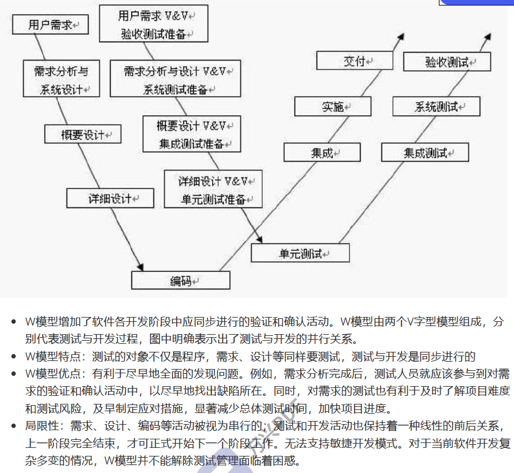
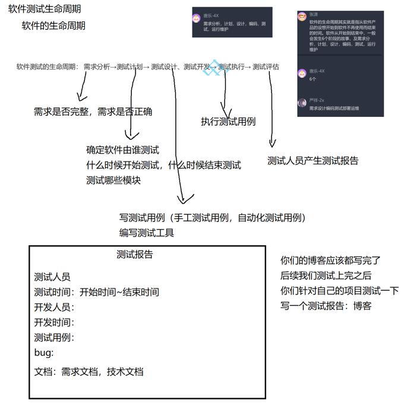
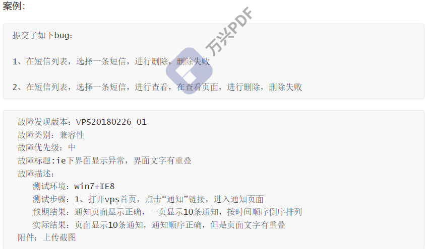
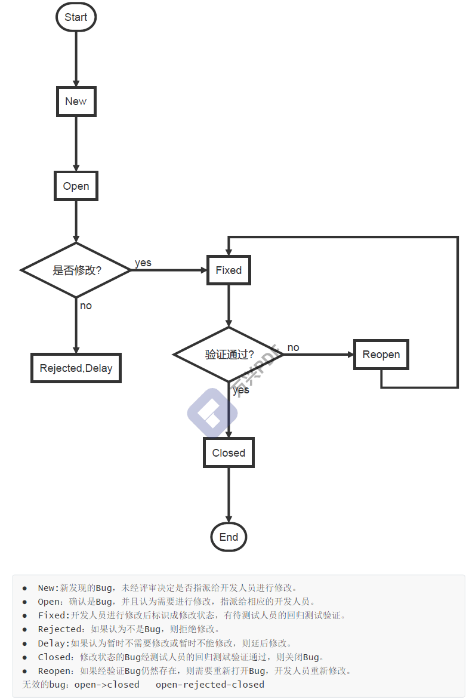

# 关于测试岗位

关于难度：**开发广度小，专业度高**；测试广度大，专业度低

投简历的话可以在简历上**同时写上测试技能与开发技能**，然后把**意向改成不一样的两份**就可以

软件测试只是一个样本实验，具有不可穷尽性

推荐书：《软件测试的艺术》

关于软件测试岗位：

- 软件测试工程师：工程师的主要工作一般包含**需求分析、编写测试计划和测试方案、设计测试用例、执行测试用例、跟踪BUG、编写测试报告**等；
- 测试开发工程师：**根据项目的特点来开发一些自动化测试的脚本**，或自动化测试的工具，或者是**软件测试工作中用到的提高工作效率的小工具**什么的，从而能够更有效地进行测试，提高软件产品的质量。测试开发工程师工作的目的就是为了更高效，**更快捷地让测试工程师进行测试工作；测试开发岗位一般要求一定的开发能力**，解决问题的能力尤为重要。
- 性能测试工程师：**针对系统进行性能测试**，包括使用工具和编写性能自动化测试脚本。
- 安全测试工程师：**主要分析产品可能会出现的安全问题**，做各个方面的渗透测试，提高产品的安全性
- 其它：系统测试工程师，嵌入式测试工程师，硬件测试工程师。

通常情况下，**黑盒测试由测试人员执行，部分白盒测试，系统测试是由开发人员执行**

# 基本概念

IEEE定义：软件需求是 

- (1)用户解决问题或达到目标所需条件或权能(Capability)。 
- (2)系统或系统部件要满足合同、标准、规范或其它正式规定文档所需具有的条件或权能。 
- 一种反映上面(1)或(2)所述条件或权能的文档说明。它包括功能性需求及非功能性需求，非功能性需求对设计和实现提出了限制，比如性能要求，质量标准，或者设计限制。

在多数软件公司，会有两部分需求，一部分是**用户需求**，一部分是**软件需求**：

- 用户需求：可以简单理解为甲方提出的需求，如果没有甲方，那么就是终端用户使用产品时必须要完成的任务。该需求一般比较简略。
- 软件需求：或者叫**功能需求**，该需求会**详细描述开发人员必须实现的软件功能**。
  大多数公司在**进行软件开发的时候会把用户需求转化为软件需求**，开发人员和测试人员工作的直接依据就是软件需求
- **软件需求是测试人员进行测试工作的基本依据**，测试的时候按软件需求来测，如果出了问题，就需要协助开发人员定位问题和解决问题

**预期结果和运行结果不符，即是 bug**

测试用例（Test Case）是为了实施测试而向被测试的系统提供的一组集合，这组集合包含：测试环境、操作步骤、测试数据、预期结果等要素。

测试用例解决了两大问题：测什么，怎么测。

**测试用例一般是让3个人写，一个人写一周**；

**测试用例**提高的是测试人员的工作效率，**降低测试人员工作的重复性问题**；

**测试用例是建立自动化的基础**

**测试工程师在需求分析和设计阶段就开始介入**，因为这个阶段**是理解和掌握软件的原始业务需求的最好时机**。

只有真正理解了原始业务需求之后，才有可能从业务需求的角度去**设计针对性明确**，**从终端用户的使用场景到端到端的覆盖率较高的测试用例集**。

**软件的生命周期**:

- 软件生命周期是指**从软件产品的设想开始到软件不再使用而结束的时间**。 如果把软件看成是有生命的事物，那么软件的生命周期可以分成**6个阶段**，即**需求分析、计划、、设计、编码、测试、运行维护**

**增量、迭代**
增量开发能显著降低项目风险，结合软件持续构建机制，构成了当今流行的软件工程最佳实践之一。

增量开发模型，鼓励用户反馈，在每个迭代过程中，促使开发小组以一种循环的、可预测的方式驱动产品的开发。因此，在这种开发模式下，每一次的迭代都意味着可能有需求的更改、构建出新的可执行软件版本，意味着测试需要频繁进行，测试人员需要与开发人员更加紧密地协作。
增量通常和迭代混为一谈，但是其实两者是有区别的。增量是逐块建造的概念，例如画一幅人物画，我们可以先画人的头部，再画身体，再画手脚……而迭代是反复求精的概念，同样是画人物画，我们可以采用先画整体轮廓，再勾勒出基本雏形，再细化、着色。

**scrum**

**软件测试 V 模型**

优点：测试被划分成许多类型

缺点：测试人员介入太晚，发现问题时机太晚

**软件测试 W 模型**

优点：测试人员尽早介入了需求

缺点：不能拥抱变化，不能适用于敏捷

---

# 基础篇

## 软件测试生命周期

软件测试的生命周期： **需求分析→测试计划→ 测试设计、测试开发→ 测试执行→ 测试评估**

- 需求阶段：测试人员**了解需求、对需求进行分解，得出测试需求**
- 计划阶段：**根据需求编写测试计划/测试方案**
- 设计阶段：测试人员适当的了解设计，对于设计测试用例是很有帮助的，**测试人员搭建测试用例框架，根据需求和设计编写一部分测试用例**
- 编码阶段：测试人员一般是不需要编码的，但已经编码的模块，专业的白盒测试人员可以计划执行单元测试，**完善、细化测试用例以及调整测试计划和方案**。
- 测试阶段：测试阶段是软件测试人员最为重要的工作阶段，**根据测试用例和计划执行测试，在执行的过程中记录、管理缺陷，测试完成后编写测试报告**。
- 运行维护：测试人员需要参与项目的实施工作。测试人员对项目产品的业务和操作非常了解，加上测试人员的沟通表达能力一般都比较强，所以测试人员可以**参与用户使用软件的培训，在试运行项目时收集问题并及时反馈给相关负责人**。

## bug要素

**一个合格的bug描述应该包括以下几个部分：**

**1、发现问题的版本**
**开发人员需要知道出现问题的版本**，才能够获取对应版本的代码来重现故障。并且版本的标识也有利于统计和分析每个版本的质量。

**2、问题出现的环境**
**环境分为硬件环境和软件环境，如果是web项目，需要描述浏览器版本，客户机操作系统等，如果是app项目，需要描述机型、分辨率、操作系统版本等**。详细的环境描述有利于故障的定位。

**3、错误重现的步骤**
**描述问题重现的最短步骤。**

**4、预期行为的描述**
**要让开发人员指导怎么样才是正确的**，尤其要以用户的角度来描述程序的行为是怎样的。如果是依据需求提出的故障，能写明需求的来源是最好的。
要相信：测试人员是最懂需求的。

**5、错误行为的描述**
**描述错误的现象**。crash等可以上传log，UI问题可以有截图。

**6、其他**
某些公司会有一些其他的要求，例如故障的分类：功能故障，界面故障，兼容性故障等。有些有优先级的分类，**严重影响测试需要开发人员优先修改的，可以设置优先级为高。**

**7、不要把多个bug放到一起**
**在无法确认是同一段代码造成的故障时，不要将bug放在一起提交。**

## bug等级

bug的定义每个公司都不一致，在定义级别之前需要查看公司规范。
以下为样例：
**1、Blocker（崩溃）：**
阻碍开发或测试工作的问题；造成系统崩溃、死机、死循环，导致数据库数据丢失，与数据库连接错误，主要功能丧失，基本模块缺失等问题。
如：**代码错误、死循环、数据库发生死锁、重要的一级菜单功能不能使用等（该问题在测试中较少出现，一旦出现应立即中止当前版本测试）。**

**2、Critical（严重）**：
系统主要功能部分丧失、数据库保存调用错误、用户数据丢失，一级功能菜单不能使用但是不影响其他功能的测试。功能设计与需求严重不符，模块无法启动或调用，程序重启、自动退出，关联程序间调用冲突，安全问题、稳定性等。
如：**软件中数据保存后数据库中显示错误，用户所要求的功能缺失，程序接口错误，数值计算统计错误等（该等级问题出现在不影响其他功能测试的情况下可以继续该版本测试）**。

**3、Major（一般）**：
功能没有完全实现但是不影响使用，功能菜单存在缺陷但不会影响系统稳定性。
如：**操作时间长、查询时间长、格式错误、边界条件错误，删除没有确认框、数据库表中字段过多等(该问题实际测试中存在最多）**

**4、Minor（次要）**：
界面、性能缺陷，建议类问题，不影响操作功能的执行，可以优化性能的方案等。如：**错别字、界面格式不规范，页面显示重叠、不该显示的要隐藏，描述不清楚，提示语丢失，文字排列不整齐，光标位置不正确，用户体验感受不好，可以优化性能的方案等（此类问题在测试初期较多，优先程度较低；在测试后期出现较少，应及时处理）**

## bug生命周期

每个公司、每一个工具对bug生命周期的定义都是不一致的，下面仅是一个常见的例子
测试人员应该跟踪一个Bug的整个生命周期，从Open到Closed的所有状态。

## 如何开始第一次测试

作为一个菜鸟在进入测试团队开始第一次测试的时候，我们需要做很多的准备：
1、阅读所有项目有关的文档，包括：需求文档、设计文档、用户手册
2、尽可能参加各种项目会议，了解项目的背景、人员组成、尽可能的了解需求和业务。特别针对业务
专业性较强的项目，例如银行业务，需要了解各种业务知识，如高低柜、一二三类账户等、存款、贷款
等。
3、熟悉项目所使用的测试管理工具、配置管理工具，获取对应的地址和登录方式
4、阅读已有的测试方案和测试案例
5、阅读旧有的bug库，了解系统功能。尤其重要的是和现有的测试团队保持一致的故障定级原则
6、了解公司的规范要求，特别是用例编写规范、用例执行规范、bug提交规范、测试工具工具使用规
范等
在进行了以上的准备工作之后，第一次测试工作到来了，我们需要与测试组长确认具体的工作内容：
1、测试的计划是什么？
2、测试的内容是什么？test case有多少？安排了几天执行？有没有自由测试的时间？
3、我要测试的内容开发人员是谁？需求人员是谁？
4、分配给我的测试内容是否需要特殊的测试资源？资源是否满足需要？
在我们确认了以上内容之后，就可以开始测试的执行了

## 测试的执行和bug管理

现在我们开始进行测试了：
1. 打开待测试的系统
2. 打开测试管理工具用例模块，开始执行用例
3. 发现bug！进行复现并确认bug的复现步骤
4. 记录bug
5. 沟通bug
6. 验证以前提交的bug
7. 确认本次测试完成
8. 编写测试报告
9. 执行测试时处理要做到测试用例和需求的覆盖外，还要有临时发挥的能力。根据自己的经验、对测试的
  感悟以及随机测试可以发现很多根据测试用例无法发现的缺陷。
  不能拘泥于测试用例或者已经有的测试方法，在测试执行过程中要不断总结测试方法和测试故障模型。
10. 真正优秀的测试人员在执行测试时是想着做，做着想，这样的测试效果才好，尤其是在测试过程中，对
  程序的处理相当了解的情况下，测试的思路会更加清晰和全面

如何发现更多的bug：

1、软件测试同样存在二八原则，80%的故障集中于20%的模块，如果某部分问题较多，加强测试广度
和深度！
2、开发人员也存在二八原则，80%的故障集中于20%的开发人员，如果某些开发人员的bug较多，加强
他开发模块的测试广度和深度！
3、多进行逆向思维和发散性的思维
4、不要局限于用例和需求文档
5、尽早介入项目, 不要等到开发的差不多了再介入项目