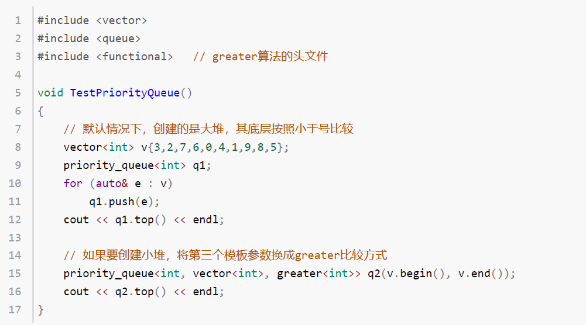

# #INT_MAX与INT_MIN

```cpp
#include <climits>
```


# 关于堆

## 关于小堆的声明



## 关于自定义堆

参考题目：

[347. 前 K 个高频元素](https://leetcode.cn/problems/top-k-frequent-elements/)

给你一个整数数组 `nums` 和一个整数 `k` ，请你返回其中出现频率前 `k` 高的元素。你可以按 **任意顺序** 返回答案。

**示例 1:**

```
输入: nums = [1,1,1,2,2,3], k = 2
输出: [1,2]
```

**示例 2:**

```
输入: nums = [1], k = 1
输出: [1]
```


**提示：**

- `1 <= nums.length <= 105`
- `k` 的取值范围是 `[1, 数组中不相同的元素的个数]`
- 题目数据保证答案唯一，换句话说，数组中前 `k` 个高频元素的集合是唯一的

 

**进阶：**你所设计算法的时间复杂度 **必须** 优于 `O(n log n)` ，其中 `n` 是数组大小。

```C++
class Solution {
public:
    // 小顶堆
    class mycomparison {
    public:
        bool operator()(const pair<int, int>& lhs, const pair<int, int>& rhs) {
            return lhs.second > rhs.second;
        }
    };
    vector<int> topKFrequent(vector<int>& nums, int k) {
        // 要统计元素出现频率
        unordered_map<int, int> map; // map<nums[i],对应出现的次数>
        for (int i = 0; i < nums.size(); i++) {
            map[nums[i]]++;
        }

        // 对频率排序
        // 定义一个小顶堆，大小为k
        priority_queue<pair<int, int>, vector<pair<int, int>>, mycomparison> pri_que;

        // 用固定大小为k的小顶堆，扫面所有频率的数值
        for (unordered_map<int, int>::iterator it = map.begin(); it != map.end(); it++) {
            pri_que.push(*it);
            if (pri_que.size() > k) { // 如果堆的大小大于了K，则队列弹出，保证堆的大小一直为k
                pri_que.pop();
            }
        }

        // 找出前K个高频元素，因为小顶堆先弹出的是最小的，所以倒序来输出到数组
        vector<int> result(k);
        for (int i = k - 1; i >= 0; i--) {
            result[i] = pri_que.top().first;
            pri_que.pop();
        }
        return result;

    }
};
```


# multiset<int, int>


在 C++ 中，`multiset` 是一个基于红黑树的数据结构，它用于存储多个元素并保持元素的有序性。你提到的问题涉及到 `multiset` 和 `pair` 类型的使用，以及为什么 `multiset<int, int>` 无法使用 `find`，而 `multiset<pair<int, int>>` 则可以。这背后的原因涉及到 C++ 中的 **类型定义** 和 **查找操作** 的特性。

### 问题解析

```cpp
typedef pair<int, int> pii;
multiset<pii> window; // 正确
// multiset<int, int> window; // 错误
```

### 1. **`multiset<int, int>` 的语法错误**

首先，`multiset<int, int>` 这种写法是 **不合法的**。这是因为 `multiset` 是一个容器类模板，它只能接收一个类型参数（表示存储的元素类型），而不能接收两个类型参数。`multiset` 是用来存储一个类型的元素，并按顺序排列这些元素。

```cpp
// 错误的写法：多余的第二个类型参数
multiset<int, int> window; // 错误：`multiset` 只能接受一个类型参数
```

在这里，`multiset<int, int>` 中的第二个 `int` 被错误地作为容器的比较器类型传入，而 `multiset` 只需要一个类型参数（表示元素类型）。因此，`multiset<int, int>` 会导致编译错误。

### 2. **`multiset<pair<int, int>>` 的正确用法**

为了存储 **`pair<int, int>`** 类型的元素（即每个元素是一个包含两个整数的对），需要使用 `multiset<pair<int, int>>`。在这种情况下，`multiset` 将会按 `pair` 类型的第一个元素进行排序（即按照 `pair.first` 的值进行排序）。如果 `pair.first` 值相同，则会按照 `pair.second` 的值进行排序。

```cpp
multiset<pair<int, int>> window; // 正确
```

这样，`multiset<pair<int, int>>` 中的元素会按 `pair` 类型的顺序存储，并且我们可以在容器中存储多个相同的 `pair` 对。由于 `pair` 类型的默认比较器是基于 `first` 元素排序的，若 `first` 元素相等，才会基于 `second` 元素排序。

### 3. **为什么 `multiset<pair<int, int>>` 可以用 `find` 而 `multiset<int, int>` 不能**

`multiset` 提供了一个成员函数 `find`，用于查找容器中是否存在某个元素。对于 `multiset<pair<int, int>>`，`find` 会依据 **`pair` 的排序规则** 来查找元素。而对于 `multiset<int, int>`，由于这是一个错误的类型定义，它并不支持 `find` 操作。

示例 1：使用 `multiset<pair<int, int>>`

```cpp
multiset<pair<int, int>> window;
window.insert({1, 2});
window.insert({3, 4});
window.insert({1, 5});

auto it = window.find({1, 2}); // 查找 pair (1, 2)
if (it != window.end()) {
    // 找到了元素
}
```

这里，`find` 查找的是一个 `pair<int, int>` 元素，并且通过默认的比较规则来确定是否能找到该元素。

示例 2：错误使用 `multiset<int, int>`

```cpp
// 错误的写法：多余的第二个类型参数
multiset<int, int> window;
```

`multiset<int, int>` 语法错误，无法编译，因此不能执行 `find` 操作。

# 键值对作为模板参数时的比较问题

当我们声明 `multiset<pair<int, int>> window;` 时，`multiset` 会自动根据元素类型（即 `pair<int, int>`）的排序规则来对元素进行排序。对于 `pair<int, int>` 类型，`multiset` 默认使用 **`pair.first`** 作为排序依据，如果 **`pair.first`** 相同，则使用 **`pair.second`** 进行排序。

### 排序规则

- **主排序依据**：`pair.first`（即 `pair` 中第一个元素的值）
- **次排序依据**：当 `pair.first` 相等时，`pair.second`（即 `pair` 中第二个元素的值）

因此，`multiset<pair<int, int>>` 会按以下规则排序：

1. 按照 `pair.first` 的值升序排列。
2. 如果多个 `pair` 的 `first` 值相等，则按 `pair.second` 的值升序排列。

### 默认排序机制

在 C++ 中，`pair` 类型的默认比较操作是通过 `operator<` 来完成的，`pair` 的 `operator<` 会先比较 `pair.first`，如果 `pair.first` 相等，再比较 `pair.second`。这意味着 `multiset<pair<int, int>>` 会按照以下规则对元素进行排序：

- 比较 `pair<int, int>` 元素时，首先比较第一个元素（`pair.first`）。
- 如果第一个元素相等，则比较第二个元素（`pair.second`）。

示例

```cpp
#include <iostream>
#include <set>
#include <utility>
using namespace std;

int main() {
    // 创建 multiset，存储 pair<int, int>
    multiset<pair<int, int>> window;

    // 插入元素
    window.insert({1, 2});
    window.insert({3, 4});
    window.insert({1, 5});
    window.insert({2, 3});
    window.insert({2, 1});

    // 输出排序后的元素
    for (auto p : window) {
        cout << "(" << p.first << ", " << p.second << ")" << endl;
    }

    return 0;
}
```

输出：

```
(1, 2)
(1, 5)
(2, 1)
(2, 3)
(3, 4)
```

解释：

1. 首先，

   ```
   pair
   ```

    元素按照 

   ```
   pair.first
   ```

    排序（第一个元素）。

   - ```
     (1, 2)
     ```

      和 

     ```
     (1, 5)
     ```

      的 

     ```
     first
     ```

      相同，所以根据 

     ```
     second
     ```

     （第二个元素）排序：

     - `(1, 2)` 排在前面，因为 `2 < 5`。

   - ```
     (2, 1)
     ```

      和 

     ```
     (2, 3)
     ```

      的 

     ```
     first
     ```

      相同，所以根据 

     ```
     second
     ```

      排序：

     - `(2, 1)` 排在前面，因为 `1 < 3`。

   - `(3, 4)` 的 `first` 比 `2` 和 `1` 大，所以它排在后面。

2. 最终，`multiset` 按照上述规则对 `pair<int, int>` 元素进行了排序。

### 自定义排序规则

如果你希望 `multiset` 使用不同的排序规则（比如降序排序），你可以通过自定义比较函数来实现。例如，按照 `pair.first` 降序排列，若 `pair.first` 相等，则按照 `pair.second` 升序排列：

```cpp
#include <iostream>
#include <set>
#include <utility>
using namespace std;

// 自定义比较器
struct Compare {
    bool operator()(const pair<int, int>& a, const pair<int, int>& b) const {
        if (a.first != b.first)
            return a.first > b.first; // 按 pair.first 降序排列
        return a.second < b.second; // 如果 pair.first 相等，则按 pair.second 升序排列
    }
};

int main() {
    // 使用自定义比较器
    multiset<pair<int, int>, Compare> window;

    // 插入元素
    window.insert({1, 2});
    window.insert({3, 4});
    window.insert({1, 5});
    window.insert({2, 3});
    window.insert({2, 1});

    // 输出排序后的元素
    for (auto p : window) {
        cout << "(" << p.first << ", " << p.second << ")" << endl;
    }

    return 0;
}
```

输出：

```
(3, 4)
(2, 1)
(2, 3)
(1, 5)
(1, 2)
```

解释：

- **`pair.first`** 降序排列：`3 > 2 > 1`。
- **`pair.second`** 升序排列：对于相同 `pair.first` 的元素，按 `pair.second` 升序排列。

总结：`multiset<pair<int, int>>` 默认会按 `pair.first` 升序排序，如果 `pair.first` 相同，则按 `pair.second` 升序排序。你也可以通过自定义比较器来调整排序规则。


# 如果想建小堆或降序排序


